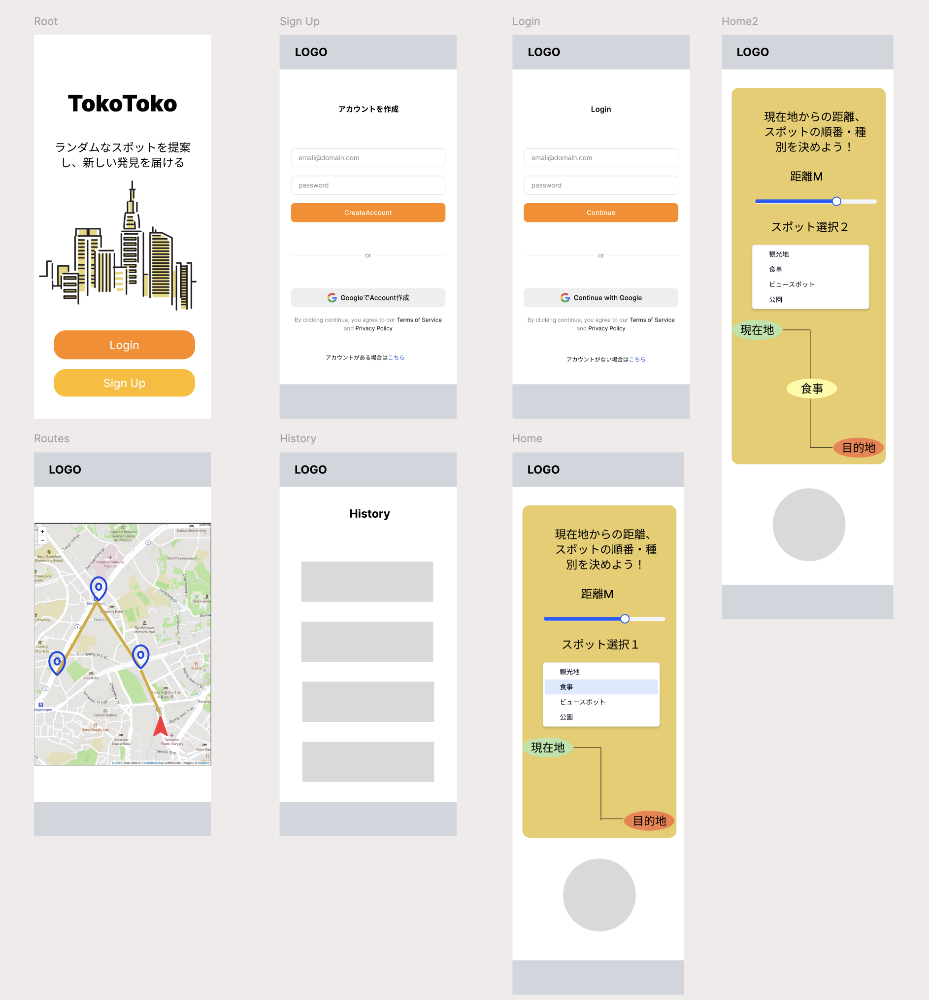

# TokoToko

# エレベーターピッチ

TokoToko は、「歩く」をもっと冒険的にする、新感覚の徒歩旅アプリです。

都市や日常の風景を、まるで RPG のマップのように再発見できる体験を提供します。ユーザーが現在地を選ぶと、ランダムな目的地を自動生成。 Google マップのように「行きたい場所」から逆算するのではなく、「どこに行くかわからないワクワク」から旅が始まります。

散歩がマンネリ化した都市生活者や、週末のちょっとした非日常を手軽に楽しみたい人を対象にしています。

従来のルート案内アプリや観光ガイドとは違い、TokoToko は「行く意味」ではなく「歩く楽しみ」を演出することに特化しています。 たとえば、水域や私有地、危険エリアを除いた安全なエリアから目的地をピックアップし、ルートを生成。 歩行距離を自分の気分に合わせて“冒険”ができます。

ただの地図アプリではなく、小さな冒険を提供するツールです。

---

# 競合アプリとの差別化ポイント

| 項目                            | 内容                                                                                                                           |
| ------------------------------- | ------------------------------------------------------------------------------------------------------------------------------ |
| **1. ランダム目的地提案機能**   | Google Maps など従来のナビアプリはユーザー主導の目的地設定が基本だが、本アプリは「未知との遭遇」を重視し、ランダム提案が中心。 |
| **2. 徒歩ルートに特化**         | 観光・冒険向けに徒歩向けだが自転車でも使える。                                                                                 |
| **3. UI/UX 演出で冒険心を刺激** | 目的地決定時に地図が「ズームイン」していく演出など、遊び心のある演出でワクワク感を演出。                                       |
| **4. 低コスト・個人向け設計**   | lieflet.js、無料の API、postgis などなるべく費用がかからない外部サービスを利用しコストカット                                   |

---

## 利用が想定される外部 API と利用目的

| API 名 / 技術                                              | 利用目的                                                 | 無料プラン / 備考                                           | 優先度        |
| ---------------------------------------------------------- | -------------------------------------------------------- | ----------------------------------------------------------- | ------------- |
| **Leaflet.js + 地図タイル API**（OSM / Mapbox / Maptiler） | 軽量なマップ表示、ルート線描画、ピン、ズーム演出         | 無料プランあり（OSM は完全無料）Mapbox は上限あり（50k/月） | ◎（MVP 中核） |
| **Nominatim (OSM)**                                        | 住所 ↔ 緯度経度変換`locations.local_name` 自動入力に利用 | 完全無料（ただし大量アクセス制限）商用は Self-host が推奨   | ○             |
| **PostGIS**                                                | 空間検索、県境判定、距離計算など全地理処理               | 無料（PostgreSQL 拡張）必須ライブラリ                       | ◎（中核技術） |

## 追加機能（将来的な差別化拡張）

| 機能                                             | 利用 API 候補                               |
| ------------------------------------------------ | ------------------------------------------- |
| **体力消費シミュレーション**（高低差・距離から） | OpenElevation + Google Fit 連携             |
| **冒険ログ保存・共有**                           | SNS 連携（Twitter API, Instagram API など） |
| **AI による冒険テーマの提案**                    | ChatGPT API or OpenAI Function Calling      |

# 課題

- 必要な言語の学習（Udemy 一周してあとは実践）
- postgis の勉強
- 外部 API を使うためのアカウントの作成
- API の呼び出し順をどうするか
- トランザクション管理をどうするか
- MVP の検討
- インフラ構成図の作成
- 使用技術の調査

# 機能要件

---

| No. | カテゴリ               | 要件内容                                                        |
| --- | ---------------------- | --------------------------------------------------------------- |
| F1  | ユーザー認証           | メールまたは OAuth でログインし、ユーザー個別の冒険データを管理 |
| F2  | ランダム目的地生成     | 現在地から一定範囲内の地点をランダムに選出する                  |
| F3  | 目的地の情報表示       | 選ばれた目的地の名称を表示                                      |
| F4  | 徒歩ルート生成         | OSM ベースで徒歩ルートを自動生成し、所要時間と距離を表示        |
| F5  | ルートスケジュール作成 | 移動予定時間・到着時間をスケジュール形式で表示                  |
| F6  | 地図表示とズーム演出   | Leaflet.js 等で地図を表示し、目的地決定時にズームイン演出を行う |
| F7  | 冒険ログ保存           | 目的地を保存                                                    |
| F8  | PWA 対応               | モバイル端末にアプリとしてインストール可能な PWA 仕様に対応     |

# 非機能要件

---

| No. | カテゴリ               | 要件内容                                                                       |
| --- | ---------------------- | ------------------------------------------------------------------------------ |
| N1  | パフォーマンス         | 目的地提案からルート表示まで、5 秒以内に完了すること                           |
| N2  | 可用性                 | サービス稼働率 99%以上（gcp などのクラウドサービスを活用）                     |
| N3  | セキュリティ           | JWT などのトークンを適切に管理する。HTTPS 化、XSS 対策                         |
| N4  | 保守性                 | API キー・設定値を環境変数で一元管理し、デプロイ・更新が容易であること         |
| N5  | モバイル最適化         | スマートフォンでの表示・操作性を優先設計とする（レスポンシブ対応）             |
| N6  | データ通信最適化       | オフライン用の地図やルートデータ等の必要最小限のみ事前取得し、通信量を節約する |
| N7  | ライセンス準拠         | 使用する地図・API（OpenStreetMap, OpenCelliD 等）の利用規約を遵守すること      |
| N8  | 多言語対応（できれば） | 国外ユーザー向けに、英語・日本語の 2 言語に対応（初期は日本語のみでも可）      |

# 各テーブルの詳細設計

---

## 1. users（ユーザー）

| カラム名      | 型        | 制約     | 説明               |
| ------------- | --------- | -------- | ------------------ |
| id            | STRING    | PK       | ユーザー ID        |
| email         | STRING    | NULL 可  | メールアドレス     |
| password_hash | STRING    | NULL 可  | パスワードハッシュ |
| provider      | STRING    | NULL 可  | OAuth プロバイダー |
| created_at    | TIMESTAMP | NOT NULL | 作成日時           |

### 2. adventures（冒険管理テーブル）

目的：冒険セッションの管理、進行状況追跡

| カラム名                | 型        | 制約         | 説明                                               |
| ----------------------- | --------- | ------------ | -------------------------------------------------- |
| id                      | STRING    | PK           | 冒険 ID                                            |
| user_id                 | STRING    | FK(users.id) | ユーザー ID                                        |
| status                  | STRING    | NOT NULL     | ステータス（planned/in_progress/completed/failed） |
| failure_reason          | STRING    | NULL 可      | 失敗理由                                           |
| planned_distance_meters | FLOAT     | NOT NULL     | ユーザーが設定した総距離（m）                      |
| waypoint_count          | INT       | NOT NULL     | 中間地点数、UI 表示と生成制御用                    |
| created_at              | TIMESTAMP | NOT NULL     | 作成日時                                           |

### 3. adventures_waypoints（ウェイポイント管理テーブル）

目的：地図上のマーカー表示、ルート生成の起終点、到達判定

| カラム名      | 型        | 制約              | 説明                                            |
| ------------- | --------- | ----------------- | ----------------------------------------------- |
| id            | STRING    | PK                | 経由地点 ID                                     |
| adventure_id  | STRING    | FK(adventures.id) | 冒険 ID                                         |
| sequence      | INT       | NOT NULL          | 地点の順番（0=出発地, 最大値=目的地）進行制御用 |
| waypoint_type | STRING    | NOT NULL          | マーカーの色、アイコン用                        |
| latitude      | FLOAT     | NOT NULL          | 緯度（地図マーカー表示）                        |
| longitude     | FLOAT     | NOT NULL          | 経度（地図マーカー表示）                        |
| location_name | STRING    | NULL 可           | 地点名                                          |
| address       | STRING    | NULL 可           | 住所（詳細地点表示用）                          |
| poi_source_id | STRING    | NULL 可           | 外部 POI API の ID（Google Places ID 等）       |
| poi_source    | STRING    | NULL 可           | データ取得元 API（google_places/OSM 等）        |
| created_at    | TIMESTAMP | NOT NULL          | 作成日時                                        |

poi_source の例（大阪城の場合）

{
"poiSource": "openstreetmap",
"poiSourceId": "1234567890abcdef"
}

### 4. routes（ルート管理テーブル）

目的： 地図上のルート線描画、徒歩ナビゲーション、距離・時間表示

| カラム名            | 型        | 制約              | 説明                                                                         |
| ------------------- | --------- | ----------------- | ---------------------------------------------------------------------------- |
| id                  | STRING    | PK                | ルート ID                                                                    |
| adventure_id        | STRING    | FK(adventures.id) | 冒険 ID                                                                      |
| from_waypoint       | STRING    | NULL 可           | 出発地点 ID（NULL の場合は現在地から）ルートの出発地点（最初の POI）を指す。 |
| to_waypoint         | STRING    | NOT NULL          | 経路の到着地点。                                                             |
| segment_order       | INT       | NOT NULL          | セグメントの順序(ルート区間の順序)                                           |
| route_json          | JSON      | NOT NULL          | GeoJSON 形式ルート（Leaflet 描画用）                                         |
| distance_meters     | FLOAT     | NOT NULL          | 各地点間の距離(M)進捗計算用                                                  |
| duration_minutes    | INT       | NOT NULL          | 推定所要時間（分）                                                           |
| transportation_mode | STRING    | NOT NULL          | 移動手段（徒歩固定）                                                         |
| created_at          | TIMESTAMP | NOT NULL          | 作成日時                                                                     |

```jsx
Adventure: 冒険A
  ├── Waypoint1 (id: a)
  ├── Waypoint2 (id: b)
  └── Waypoint3 (id: c)

Routes テーブルにはこう記録される：

1. from: null(現在地) → to: a      ← 冒険のスタート地点
2. from: a    → to: b
3. from: b    → to: c      ← 最終目的地
```

### 5. locations（POI 参照用マスターデータ、外部 API から持ってくるのでローカルの postgress にテーブルを作らなくてもいい）

| カラム名      | 型        | 制約     | 説明                                              |
| ------------- | --------- | -------- | ------------------------------------------------- |
| id            | UUID      | PK       | 地点 ID                                           |
| name          | STRING    | NOT NULL | 地点名                                            |
| latitude      | FLOAT     | NOT NULL | 緯度                                              |
| longitude     | FLOAT     | NOT NULL | 経度                                              |
| type          | STRING    | NOT NULL | 地点タイプ（park/restaurant/scenic/tourist_spot） |
| is_accessible | BOOLEAN   | NOT NULL | アクセス可能                                      |
| is_water_area | BOOLEAN   | NOT NULL | 水域フラグ                                        |
| source        | STRING    | NOT NULL | データソース（osm/manual/api）                    |
| created_at    | TIMESTAMP | NOT NULL | 作成日時                                          |

### 制約

1. **UNIQUE 制約**: `(adventure_id, sequence)` - 同じ冒険内で順番重複防止
2. **外部キー制約**: 全て適切な CASCADE 設定
3. **CHECK 制約**: `sequence >= 1` - 順番は 1 から開始

# ER 図


# ワイヤーフレーム



# MVP

---

| 項目                                 | 内容                                 | 必須 |
| ------------------------------------ | ------------------------------------ | ---- |
| 現在地の取得                         | GPS で現在地取得                     | ◎    |
| 距離の指定                           | 例：3km / 5km / 10km など            | ◎    |
| ランダムな目的地生成                 | 範囲内で 1 地点抽出                  | ◎    |
| 徒歩ルート生成                       | 現在地 →p1→p2→ 目的地                | ◎    |
| 地図表示                             | Leaflet.js でルート可視化            | ◎    |
| 地点が水域・立入禁止でないことを確認 | PostGIS でフィルタ                   | ○    |
| 旅の履歴保存                         | `adventures`, `routes` 保存          | ○    |
| 冒険スタート演出                     | 地図のズームイン、アニメーションなど | ○    |

---

## ルート生成の例

## 現在地 → 東京駅 → 表参道 → 新宿

### Waypoints（ウェイポイント）

`waypoints = [
  {
    id: "wp-001",
    sequence: 0,
    waypointType: "START",
    locationName: "東京駅",
    latitude: 35.6812,
    longitude: 139.7671
  },
  {
    id: "wp-002",
    sequence: 1,
    waypointType: "INTERMEDIATE",
    locationName: "表参道",
    latitude: 35.6586,
    longitude: 139.7454
  },
  {
    id: "wp-003",
    sequence: 2,
    waypointType: "DESTINATION",
    locationName: "新宿",
    latitude: 35.6938,
    longitude: 139.7036
  }
]`

### Routes（ルート）

`routes = [
  {
    id: "route-001",
    fromWaypointId: null,      *// 現在地から（ウェイポイントではない）*
    toWaypointId: "wp-001",    *// 東京駅へ*
    distanceMeters: 1500,
    durationMinutes: 18,
    routeJson: { */* 現在地→東京駅の経路データ */* }
  },
  {
    id: "route-002",
    fromWaypointId: "wp-001",  *// 東京駅から*
    toWaypointId: "wp-002",    *// 表参道へ*
    distanceMeters: 3200,
    durationMinutes: 35,
    routeJson: { */* 東京駅→表参道の経路データ */* }
  },
  {
    id: "route-003",
    fromWaypointId: "wp-002",  *// 表参道から*
    toWaypointId: "wp-003",    *// 新宿へ*
    distanceMeters: 2800,
    durationMinutes: 30,
    routeJson: { */* 表参道→新宿の経路データ */* }
  }
]`

---

## UI の流れ

ルート構成の最終形（MVP レベルでも最低限必要）

```

[現在地] → [スポット1] → [スポット2] → [スポット3] → [目的地]

```

- スポット 1〜3：ユーザーが選んだ種別（例：公園、神社、景観等）に従ってランダム抽出
- 目的地：完全にランダム or 条件付きランダム
